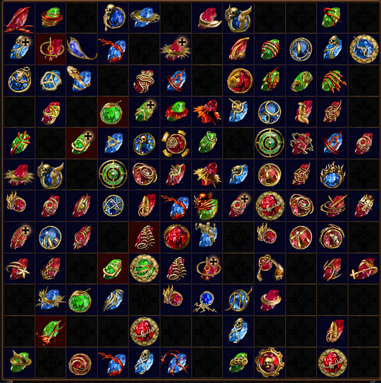
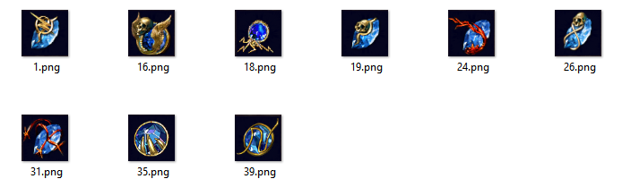
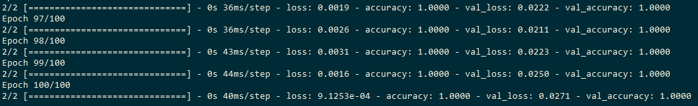
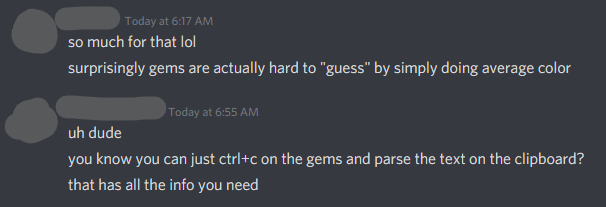

<a href="https://www.buymeacoffee.com/krisives" target="_blank"></a>

# Sorting Gems in Path of Exile with Tensorflow

So you're playing *[Path of Exile](https://pathofexile.com)* and every once in a
while you grab a gem, throw it into your stash. Then a few days later you grab a
gem from your stash. Of course, you're lazy, and eventually you're left with a
stash tab for gems that looks like this:



This triggers you worse than
[CWDT](https://pathofexile.gamepedia.com/Cast_when_Damage_Taken_Support) and
cannot be tolerated. But, you're still *very* lazy and certainly won't be
spending precious seconds organizing all of those gems.

Thankfully, you've got Python and an unexplainable desire to spend your time
doing anything but real work. See it in action here:

[](http://www.youtube.com/watch?v=pduPD-6Eu1w)

*(Video: Path of Exile Gem Sorting)*

## pyautogui

The `pyautogui` toolkit is pretty awesome. It provides basic functionality for
grabbing screenshots and simulating mouse clicks or keyboard shortcuts. For this
task we really only need to grab the screen and do some mouse clicks.

```bash
pip install pyautogui
```

## Detecting gem color

Originally I had planned on simply looking at the average color of a gem. As it
turns out, that really doesn't work very well for this task. There are a few
different problems throw a wrench into those gears:

* Gems have a background hint color of either red or blue, depending on if your
current character has the stat requirements to equip the gem. If your character
can equip, it's a blue-ish background, otherwise it's a red-ish background.

* Many gems in the game have a *Vaal* counterpart, like
[Vaal Cyclone](https://pathofexile.gamepedia.com/Vaal_Cyclone). Each of these
gems will have a red thingy on the gem image, even if the gem is actually a blue
or green gem.

* Non-Vaal gems have a goldish thingy on the gem image. For some gems this isn't
a big deal, but for others, like [Cast When Damage
Taken](https://pathofexile.gamepedia.com/Cast_when_Damage_Taken_Support) or
[Cast on Critical
Strike](https://pathofexile.gamepedia.com/Cast_On_Critical_Strike_Support) it
composes a significant portion of the image and throws off the average color.

I attempted to work around this by filtering the image for certain colors, but
once I remembered that Vaal skills exist (which is strange because my main
character's main skill is a vaal skill) I realized I needed a better way of
classifying gems. As you'll see a reoccurring problem is my inability to
remember things.

## Tensorflow

Yes, you have permission to get mad now. Stay mad too, since there is no point
in context switching as you're probably going to get mad again while reading
this.

```
pip install tensorflow
```

The goal here is we need to train an image classifier to detect the three main
different colors of gems, as well as empty inventory slots since the in-game
behavior of clicking an empty inventory slot is different. Before we can train a
model we need some sample data. That's easy enough since we can grab a few
images and label them by putting them into different directories.

## Preparing data

First, we have to determine the size of a inventory slot. I'm a highly qualified
expert, so I open the screenshot up in `mspaint.exe` and drag select the general
area of a gem and "approximate" it at `52x52` pixels.

Next we have to grab some examples of gems for Tensorflow to use during
training. Paint fights me a bit here by constantly resizing the canvas, so I
switch to Photoshop and make the canvas `52x52` then use the Move Layer tool to
slide the image around periodically saving it out as a new `.png` file with an
incremented name.

Now we create directories for each label, in this case: `'blue'`, `'empty'`,
`'green'` and `'red'`. Note that anytime we use labels they will be in this
(sorted) order. This is because under-the-hood Tensorflow is creating a model
that has 4 outputs, each of which is confidence values for these different
categories. If we mess up the ordering on the labels or change it after training
things won't line up correctly.

Each directory includes some images of gems of that color, for example `blue/`
contains:



## Training

Firstly, you'll notice that our code starts out with this snippet:

```python
# Tensorflow crashes and burns on a video card if this doesn't exist...
gpus = tf.config.experimental.list_physical_devices('GPU')
if gpus:
  try:
    # Currently, memory growth needs to be the same across GPUs
    for gpu in gpus:
      tf.config.experimental.set_memory_growth(gpu, True)
    logical_gpus = tf.config.experimental.list_logical_devices('GPU')
    print(len(gpus), "Physical GPUs,", len(logical_gpus), "Logical GPUs")
  except RuntimeError as e:
    # Memory growth must be set before GPUs have been initialized
    print(e)
```

This makes about as much sense as [Pepsi for TV
game](https://www.youtube.com/watch?v=3Dy7VUQb780), but without it Tensorflow
does crash when trying to use a GPU. Training this model never gets close to
exceeding the system memory or GPU memory, so yeah, I don't understand why.

Thankfully the data pipeline for training is very simple:

```python
train_ds = tf.keras.preprocessing.image_dataset_from_directory(
    data_dir,
    validation_split=0.2,
    subset="training",
    seed=123,
    image_size=(img_height, img_width),
    batch_size=batch_size)
```

This automatically creates a dataset that reads the labels from the names of the
directory and each individual image is treated as a sample.

Now we'll create a model:

```python
model = Sequential([
    layers.experimental.preprocessing.Rescaling(1./255, input_shape=(img_height, img_width, 3)),
    layers.Conv2D(8, 3, padding='same', activation='relu'),
    layers.MaxPooling2D(),
    layers.Dropout(0.3),
    layers.Conv2D(16, 3, padding='same', activation='relu'),
    layers.MaxPooling2D(),
    layers.Dropout(0.3),
    layers.Conv2D(32, 3, padding='same', activation='relu'),
    layers.MaxPooling2D(),
    layers.Dropout(0.3),
    layers.Flatten(),
    layers.Dense(128, activation='relu'),
    layers.Dense(num_classes)
])
```

This is a model that uses convolutional layers, max pooling and a dense layer at
the end. For this purpose, it probably could have simply been a small dense
layer without the other stuff. ~~The convolutional sizes probably don't even make
any sense for this specific problem since `32x32` is almost half the size of the
image.~~ I made a mistake and the convolutional size is actually `3x3` with 32
different filters.

The last thing that might matter at all is to do some basic data augmentation:

```python
data_augmentation = tf.keras.Sequential([
    layers.experimental.preprocessing.RandomTranslation(0.1),
    layers.GaussianNoise(0.1)
])
```

Here we're adding a bit of random noise and some random translation. The noise
is to avoid the network overfitting; if possible we want it to generalize so I
don't have to generate new images when a new skill gem is created. The random
translation is in case I have the inventory grid slightly off by a few pixels or
if the game changes it's graphics in insignificant ways in the future.

Lastly we train the model and save it:

```python
history = model.fit(
    train_ds,
    validation_data=val_ds,
    epochs=epochs
)

model.save("gem_classifier.hdf5")
```



We basically now have a 1.8MB blob of data in `gem_classifier.hdf5` that when
asked "What color gem is this?" it will respond with `'blue'`, `'empty'`,
`'green'` or `'red'`.

If you have the repository you can do this by running:

```bash
python train_sorter.py
```

## Grabbing a screenshot

We've got our blob of AI magic that predicts images, so now we need an easy way
to pass images to it. First, let's get a screenshot:

```python
screen = pyautogui.screenshot()
```

This assumes that the game is running in "windowed fullscreen" mode. Yeah, that
is what it's actually called. Pepsi for TV game. Also your resolution should be
set to `1920x1080` and if not you'll need to rescale the image:

```python
screen = screen.resize((1920, 1080))
```

Note that if you resize you're officially in "no man's land" since I have no
idea how tolerant any of the code is to being resized. I actually expect the
classifier is decent at handling images that are scaled up or down, but I can't
say the same for the code for grabbing inventory slots on screen.

## Creating an inventory

Before we can do much with an inventory we need one. We'll make two classes:

```python
@dataclass(repr=True)
class Cell:
    col: int
    row: int
    type: str = 'empty'

class Stash:
    def __init__(self):
        self.cells = []
        for row in range(0, 12):
            for col in range(0, 12):
                self.cells.append(Cell(col, row, 'empty'))

    def get(self, col, row):
        return self.cells[col + row * 12]

    def update(self, cell):
        self.cells[cell.col + cell.row * 12] = cell

    def swap(self, a, b):
        a_col = a.col
        a_row = a.row
        a.col = b.col
        a.row = b.row
        b.col = a_col
        b.row = a_row
        self.update(a)
        self.update(b)
```

## Predicting an inventory slot

Let's make a function that when we pass it an inventory slot it uses the model
to predict the contents of that slot:

```python
def predict_cell(col, row):
    x, y = locate_cell(col, row)
    cell = screen.crop((x, y, x + cell_size, y + cell_size))
    img_array = tf.keras.preprocessing.image.img_to_array(cell)
    img_array = tf.expand_dims(img_array, 0)
    predictions = model.predict(img_array)
    score = tf.nn.softmax(predictions[0])
    confidence = np.max(score)
    gem = class_names[np.argmax(score)]
    return gem
```

First we crop the screen with `screen.crop()` so that we're left with a `52x52`
image. Next we turn that into an `img_array` or "batch" which is just something
Tensorflow likes to do. Finally we'll get an array of `predictions` from the
model and select the one with the highest confidence value. Since we want to
work with the text labels we'll map back the `class_names` instead of working
with arbitrary integer index values.

## Actually sorting things

Oh, yeah, we're supposed to be *sorting* these damn gems. But, by this point my
ADHD is kicking in pretty hard:

[](http://www.youtube.com/watch?v=OXqkTzyifJQ)

*(Video: Rick & Morty: I just got bored, everybody out)*

This is the part where I'm supposed to get really in-depth about how this is an
[in-place sort](https://en.wikipedia.org/wiki/Sorting_algorithm#Classification)
and how we have limited bandwidth on swaps because we have to actually click a
game in gem. In the code we have all kinds of `time.sleep(0.1)` to avoid
spamming the game with too many actions or risk the game not detecting a mouse
action. **I don't even want to imagine what madness occurs if it misses a
click**. It probably vendors all my
[exalts](https://pathofexile.gamepedia.com/Exalted_Orb). That's about as much as
I'll say about the cool things one *could* do with sorting correctly, but I
think someone else could make an entertaining follow-up that expands on this.

In a perfect world we would just call `pyautogui.click()` and [life, uh, finds a
way](https://www.youtube.com/watch?v=kiVVzxoPTtg). My guess is that `click()`
doesn't give the game enough time between frames to process the mouse down and
up events, so instead we'll roll our own:

```python
def click_cell(col, row):
    x, y = locate_cell(col, row, cell_size // 2)
    pyautogui.moveTo(x, y)
    time.sleep(0.05)
    pyautogui.mouseDown()
    time.sleep(0.05)
    pyautogui.mouseUp()
    time.sleep(0.05)
```

Note here that we're clicking into the center of the cell (`cell_size // 2`)
since I did learn something, which is that there are actually areas of the Path
of Exile inventory that are "dead spots" and don't seem to react to clicks. I
also learned you can actually click and drag in the inventory, but for the
purpose of simplicity we'll be using the tried and true click once, move, click
again method of managing the inventory.

First let's predict all of the inventory slots:

```python
for col in range(0, 12):
    for row in range(0, 12):
        cell = stash.get(col, row)
        cell.type = predict_cell(col, row)
```

Now we'll filter out the empty slots:

```python
filtered = filter(lambda cell: cell.type != 'empty', stash.cells)
```

And sort them by type:

```python
organized = sorted(filtered, key=lambda cell: cell.type)
```

~This is the part where someone would put in some *actually good* code to do
vertical alignment and separation or at least something decent. Instead we'll be
simply taking that sorted list using it raw!~ I ended up adding functions
for doing horizontal or vertical layout before pushing to GitHub.

```python
col = 0
row = 0
last_type = None
next = vertical_next
gap = vertical_gap

for source in organized:
    if last_type and last_type != source.type:
        col, row = gap(col, row)

    last_type = source.type

    if source.col == col and source.row == row:
        col, row = next(col, row)
        continue

    dest = stash.get(col, row)

    if dest.type == 'empty':
        click_cell(source.col, source.row)
        time.sleep(0.2)
        click_cell(dest.col, dest.row)
        time.sleep(0.2)
    else:
        click_cell(source.col, source.row)
        time.sleep(0.2)
        click_cell(dest.col, dest.row)
        time.sleep(0.2)
        click_cell(source.col, source.row)
        time.sleep(0.2)

    stash.swap(source, dest)
    col, row = next(col, row)
```

There are two different use cases here. If we're moving a gem to an empty slot
we can simply click, move, and click. The cursor will be empty afterwards and
all is well. However, if the destination slot is not empty we have to put the
gem that is placed onto the cursor into the empty source slot we created
initially. It's pretty confusing to explain, and if you've never played a game
that has inventory management I don't fault you for not understanding this
poorly written excuse for an explanation.

Now you can move whatever you're using to run `python` out of the way of the
inventory, run this command, then alt-tab back into game:

```bash
python sorter.py
```

If all goes well you'll begin seeing all your gems get sorted by color. If all
goes less than well all your doodoo will get vendored or just destroyed as you
drop it in your hideout. **I have no idea what the frick any of this code will
do if ran on a regular stash tab that doesn't contain only gems**.

## Everything we did was pointless

So now it's time to go back to discord and see what that pending message my
friend sent me. He's probably super impressed by my elite skills and 5D chess:



That's a good point, friend. I should have remembered this since I regularly use
this feature to price check items on [poeprices.info](https://poeprices.info)
which uses machine learning to attempt to guess at the market price of an item.

## Is this "legit"?

That's a good question. To be clear I do not work for or have any kind of inside
knowledge of what [Grinding Gear Games](https://grindinggear.com/) policies are.
Obviously they (and the community) are against the creation of bots that cheat
or automatically play the game. They ruin the game for the rest of us and
distort the in-game item economy, which for Path of Exile is a significant part
of the game.

On the one hand we have GGG saying that [using a popsicle stick to press
multiple buttons at once is not
allowed](https://dd.reddit.com/r/pathofexile/comments/5t303e/popsicle_stick_over_12345_for_flasks_is_not/)
because it adds an "unfair advantage" over other players. On the other hand we
have a wealth of utilities and tools like
[MecuryTrade](https://github.com/Exslims/MercuryTrade) and
[TradeMacro](https://github.com/PoE-TradeMacro/POE-TradeMacro) which are used to
make trading with many people less painful.

If I had my account flagged or banned because of this I would appeal it. I don't
see any my gems being sorted or unsorted affects any other player. Obviously my
opinion here means very little, though, and if someone gets banned I'm not
taking responsibility for anything. I could see a possibility where Grinding
Gears gets their gears grinded by replicating microtransaction features. For
example, if they had some kind of special tab that sorted all your skill gems
for you. Most of their special stash tab upsells are much more useful than
something like this and provide more value, though, so I doubt that is a
concern.
